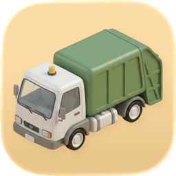

<p align="center">
  
</p>

# Garbage Truck

A macOS app that finds and removes leftover files when you delete applications.

When you drag an app to the Trash, macOS leaves behind caches, preferences, containers, logs, and other support files scattered across `~/Library`. Garbage Truck finds them so you can clean up.

## Install

**[Download the latest release](../../releases/latest/download/GarbageTruck-mac.dmg)** — open the DMG and drag Garbage Truck to your Applications folder.

Alternatively, build from source:

```bash
git clone https://github.com/samsolomon/garbage-truck.git
cd garbage-truck
xcodebuild -scheme GarbageTruck -destination 'platform=macOS' build
```

The built app will be in `build/Release/GarbageTruck.app`.

## Features

- **Automatic detection** — Smart Delete watches your Applications folders and prompts you to clean up as soon as an app is removed
- **5-tier matching** — finds leftovers by bundle ID, container, and app name with confidence ratings (high/medium) so you know what's safe to remove
- **Undo** — deleted files are moved to Trash, and the last 10 deletions can be undone with `⌘Z`
- **Drag and drop** — drop any `.app` bundle onto the window to scan it
- **Keyboard-driven** — search, navigate, and select entirely from the keyboard
- **Full Disk Access aware** — prompts for FDA on first launch and shows which directories couldn't be scanned

## Scanned locations

Garbage Truck checks these directories under `~/Library`:

Application Support, Caches, Containers, Group Containers, Preferences, Logs, Saved Application State, HTTPStorages, Cookies, WebKit, LaunchAgents, and CrashReporter.

## Requirements

- macOS 14+
- Full Disk Access (recommended) for complete scanning coverage

## Notes

- A startup hang in early packaged releases was fixed by simplifying launch-time work and app scenes. See `docs/startup-postmortem.md`.
